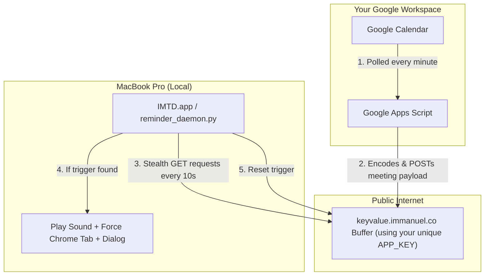

# Intelligent Meeting Takeover Daemon (IMTD)

IMTD is a hybrid cloud-local automation suite designed for developers and deep-workers. It solves the problem of "missing meetings due to hyper-focus" by physically yanking you out of your work environment.

Exactly 1 minute before a Google Meet, Zoom, or Teams call starts, IMTD will:
1. Play a loud system alarm on your MacBook.
2. Force Google Chrome to the front.
3. Automatically open a new tab straight into the meeting room.
4. Lock your screen with a native "JOIN MEET" dialog box.
5. (Optional) Send a critical alert bypassing Do Not Disturb to your iPhone via Bark.

## 🛡️ Enterprise Security & Privacy First
- **No Cloudflare Tunnels or Inbound Ports:** The local daemon uses a 100% stealthy HTTPS polling mechanism (standard outbound web traffic) meaning it is practically invisible to corporate IT security tools like Zscaler, Netskope, or CrowdStrike.
- **Zero-Trust Event Routing:** Your Google Calendar is parsed locally inside your *own* personal Google Apps Script cloud. Meeting URLs are Base64 encoded and passed through a secure, anonymous key-value buffer. 
- **100% Autonomous:** You don't configure alarms. If a meeting is canceled or moved on your calendar, the daemon automatically adapts.

---

## 🚀 2-Minute Installation Guide (Plug & Play)

### Phase 1: MacBook Setup (One-Click)
1. Clone or download this repository to your Mac.
2. Open your terminal and navigate to the folder.
3. Run the installer script:
   ```bash
   bash install.sh
   ```
4. **Copy the App Key!** The script will print a unique `APP_KEY` (e.g., `a7b3x9zz`) to your terminal. Copy this key, you will need it for Phase 2.

> *The script will automatically compile the daemon as a native macOS background app, hide it from your Dock, and register it to start automatically every time you turn on your computer.*

### Phase 2: Google Cloud Setup
1. Go to [script.google.com](https://script.google.com) and create a New Project.
2. Copy all the code from `AppsScript.js` and paste it into the editor.
3. Replace the `KV_APP_KEY` placeholder at the very top of the script with the key generated from your terminal.
4. Click the **Save** (floppy disk) icon.
5. Setup the Auto-Trigger:
   * In the left sidebar, click the **Triggers** icon (looks like an alarm clock).
   * Click **Add Trigger** (bottom right).
   * Choose function to run: `checkUpcomingMeetings`
   * Select event source: **Time-driven**
   * Select type of time based trigger: **Minutes timer**
   * Select minute interval: **Every minute**
   * Click **Save**. *(Google will ask you to authorize calendar access. Click Allow.)*

**🎉 You're done!** 
Create a dummy event on your calendar starting 2 minutes from now, put a Google Meet link in the location field, and watch the magic happen.

---

## 🛠️ Architecture


