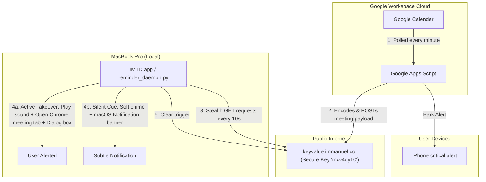

# Intelligent Meeting Takeover Daemon (IMTD)
## Complete Technical Documentation & Installation Guide

The **Intelligent Meeting Takeover Daemon (IMTD)** is a hybrid cloud-local automation suite designed to solve the "meeting missed due to hyper-focus" problem. It ensures you never miss a corporate Google Meet or Zoom session by aggressively bringing meeting tabs to the foreground on your MacBook and triggering critical alarms on your iPhone, while remaining completely silent and non-disruptive if you are already in a call.

---

## 📖 1. Use Case & Problem Statement

### The Problem
* **The Hyper-Focus Trap:** Developers and power-users often get absorbed in coding or writing, missing subtle desktop banners or muted calendar alerts.
* **Spark Email Client Silence:** Spark and other third-party email clients lack robust, intrusive alert mechanisms to pull users out of their environment when a meeting starts.
* **macOS TCC Lockouts:** Running background agents (`launchd`) that query Apple's native Calendar API triggers silent permission blocks (TCC hangs) on macOS, meaning local background scripts cannot safely fetch your agenda.
* **Corporate IT Web App Blocking:** Corporate Google Workspace accounts block publishing web apps to the public internet ("Anyone"), making direct incoming webhook calls to a local machine impossible or requiring tedious OAuth flows.

### The Solution (IMTD)
IMTD addresses these issues by decoupling calendar parsing from the local MacBook. 
* **Cloud Parsing:** A lightweight Google Apps Script runs under your own Google credentials, parses calendar events, and identifies meetings starting in exactly 1 minute.
* **Zero-Trust Egress Polling:** The MacBook daemon performs a standard HTTPS `GET` request every 10 seconds to an anonymous cloud registry (`keyvalue.immanuel.co`), pulling any active meeting alerts. Because it is purely outbound HTTPS traffic, **it requires no open ports, no Cloudflare tunnels (`cloudflared`), and is 100% invisible to enterprise network tracking/security tools.**
* **Polite In-Meeting Interrupts:** If you are already in a Zoom or Google Meet tab, the MacBook script shifts to "subtle cue mode" (playing a soft chime and a notification banner) to prevent audio loops or screen disruption. If you are idle, it plays a loud alarm and yanks Chrome to the foreground.

---

## 📊 2. Architecture & Communication Flow

The diagram below outlines how the cloud scheduler, anonymous registry, local MacBook daemon, and iPhone communicate:



---

## 📦 3. System Dependencies

* **Google Account:** Access to Google Calendar and Google Apps Script (Standard & free).
* **MacBook (macOS):**
  * Python 3 (`/usr/local/bin/python3` or standard Xcode/Homebrew installation).
  * Google Chrome installed.
  * AppleScript system access (standard).
* **iPhone (Optional):**
  * **Bark** notification app (free from the App Store) to receive iPhone alerts.
* **Cloud Database:**
  * Uses the free REST API hosted at `keyvalue.immanuel.co` (zero-signup, zero-cost, serverless).

---

## 🛠️ 4. Zero-to-Hero Installation Guide

Follow these steps to deploy IMTD from scratch:

### Step 1: Create the Local Daemon Script on your Mac
Save the following Python script at `/Users/tarartem/Library/Application Support/reminder_daemon.py`:

```python
#!/usr/bin/env python3
import subprocess
import threading
import time
import re
import json
import ssl
import urllib.request
import urllib.parse
import base64

# =========================================================================
# ⚙️ CONFIGURATION
# =========================================================================
BARK_KEY = "adj6sfggZvVnNfriv8xwhf"   # Bark iPhone push key
APP_KEY = "mxv4dy10"                   # Unique key connecting Apps Script and your Mac
KV_GET_URL = f"https://keyvalue.immanuel.co/api/KeyVal/GetValue/{APP_KEY}/trigger"
KV_SET_URL = f"https://keyvalue.immanuel.co/api/KeyVal/UpdateValue/{APP_KEY}/trigger/"

triggered_ids = set()

# =========================================================================
# 🚨 CHROME TAKEOVER & POLITE ALERTING
# =========================================================================
def is_currently_in_meeting():
    applescript = """
    tell application "Google Chrome"
        set tabInfo to ""
        try
            repeat with w in windows
                repeat with t in tabs of w
                    set tabInfo to tabInfo & "TITLE:" & (title of t) & "||URL:" & (URL of t) & "###"
                end repeat
            end repeat
        on error
            set tabInfo to ""
        end try
        return tabInfo
    end tell
    """
    try:
        proc = subprocess.Popen(
            ['osascript', '-e', applescript],
            stdout=subprocess.PIPE, stderr=subprocess.PIPE, text=True
        )
        out, _ = proc.communicate(timeout=3)
        for block in out.split('###'):
            if not block.strip():
                continue
            title_match = re.search(r'TITLE:(.*?)\|\|URL:', block, re.DOTALL)
            url_match = re.search(r'\|\|URL:(.*)', block, re.DOTALL)
            if title_match and url_match:
                title = title_match.group(1).lower()
                url = url_match.group(1).lower()
                is_meet = "meet.google.com/" in url and re.search(r'/[a-z]{3}-[a-z]{4}-[a-z]{3}', url)
                is_zoom = ".zoom.us/j/" in url or ".zoom.us/s/" in url
                if is_meet or is_zoom:
                    inactive = ["left the meeting", "you left", "ready to join?", "google meet"]
                    if not any(kw in title for kw in inactive):
                        return True
    except:
        pass
    return False

def trigger_chrome_takeover(title, meet_url):
    if is_currently_in_meeting():
        # Soft notification
        subprocess.Popen(['afplay', '/System/Library/Sounds/Tink.aiff'])
        time.sleep(0.3)
        subprocess.Popen(['afplay', '/System/Library/Sounds/Tink.aiff'])
        subtle_script = f'display notification "Starts in 1 min. Click to switch." with title "Next Meeting" subtitle "{title}"'
        subprocess.run(['osascript', '-e', subtle_script])
    else:
        # Loud alarm
        subprocess.Popen(['afplay', '/System/Library/Sounds/Sosumi.aiff'])
        takeover_script = f"""
        tell application "Google Chrome"
            activate
            if (count of windows) is 0 then
                make new window
            end if
            tell window 1
                make new tab with properties {{URL:"{meet_url}"}}
            end tell
        end tell
        tell application "System Events"
            activate
            display dialog "🚨 MEETING STARTING IN 1 MINUTE:\\n\\n{title}" with title "Meeting Alarm" buttons {{"JOIN MEET"}} default button "JOIN MEET" giving up after 15
        end tell
        """
        subprocess.run(['osascript', '-e', takeover_script], timeout=20)

# =========================================================================
# 📡 POLLING LOOP
# =========================================================================
def clear_trigger_in_cloud():
    try:
        url = f"{KV_SET_URL}null"
        cmd = ['curl', '-s', '-X', 'POST', '-H', 'Content-Length: 0', url]
        subprocess.run(cmd, stdout=subprocess.DEVNULL, stderr=subprocess.DEVNULL, timeout=5)
    except:
        pass

def check_for_trigger():
    global triggered_ids
    try:
        req = urllib.request.Request(KV_GET_URL, headers={'User-Agent': 'Mozilla/5.0'})
        context = ssl._create_unverified_context()
        with urllib.request.urlopen(req, context=context, timeout=5) as response:
            raw_val = response.read().decode('utf-8').strip()
            if raw_val.startswith('"') and raw_val.endswith('"'):
                raw_val = raw_val[1:-1]
            if not raw_val or raw_val == "null":
                return
            try:
                missing_padding = len(raw_val) % 4
                if missing_padding:
                    raw_val += '=' * (4 - missing_padding)
                decoded_bytes = base64.urlsafe_b64decode(raw_val)
                data = json.loads(decoded_bytes.decode('utf-8'))
                meeting_id = data.get('id')
                title = data.get('title')
                meet_url = data.get('url')

                if meeting_id and meeting_id not in triggered_ids:
                    triggered_ids.add(meeting_id)
                    threading.Thread(target=trigger_chrome_takeover, args=(title, meet_url), daemon=True).start()
                    clear_trigger_in_cloud()
            except:
                clear_trigger_in_cloud()
    except:
        pass

def main():
    while True:
        check_for_trigger()
        time.sleep(10)

if __name__ == "__main__":
    main()
```

---

### Step 2: Compile the MacBook Startup Daemon Wrapper
To execute this script silently on MacBook startup without a terminal window, compile it as a native macOS Application Bundle:

1. Open your terminal and run:
   ```bash
   osacompile -o "/Users/tarartem/Applications/IMTD.app" -e "do shell script \"/usr/local/bin/python3 '/Users/tarartem/Library/Application Support/reminder_daemon.py' > /tmp/reminder_daemon.log 2>&1 &\""
   ```
2. Hide the app icon from your macOS Dock so it runs completely in the background:
   ```bash
   plutil -insert LSUIElement -bool YES "/Users/tarartem/Applications/IMTD.app/Contents/Info.plist"
   ```
3. Set the application to launch automatically at login:
   * Go to **System Settings ➔ General ➔ Login Items & Extensions**.
   * Under **Open at Login**, click the **+ (Plus)** button.
   * Navigate to `/Users/tarartem/Applications` and select **`IMTD.app`**.

---

### Step 3: Deploy the Google Apps Script (Cloud Trigger)
1. Go to [script.google.com](https://script.google.com).
2. Create a new project.
3. Paste the following Google Apps Script code (replacing all default code):

```javascript
var BARK_KEY = "adj6sfggZvVnNfriv8xwhf";
var TRIGGER_SECRET = "imtd-secret-2026";
var KV_APP_KEY = "mxv4dy10";

function checkUpcomingMeetings() {
  var now = new Date();
  var searchStart = new Date(now.getTime() - 30 * 1000);
  var searchEnd = new Date(now.getTime() + 180 * 1000);

  var calendar = CalendarApp.getDefaultCalendar();
  var events = calendar.getEvents(searchStart, searchEnd);
  var properties = PropertiesService.getScriptProperties();

  for (var i = 0; i < events.length; i++) {
    var event = events[i];
    if (event.isAllDayEvent()) continue;

    var triggerKey = event.getId() + "_" + event.getStartTime().getTime();
    var diffSeconds = (event.getStartTime().getTime() - now.getTime()) / 1000;

    if (diffSeconds >= 20 && diffSeconds <= 100) {
      if (!properties.getProperty(triggerKey)) {
        var meetUrl = getEventMeetingUrl(event);
        if (meetUrl) {
          var title = event.getTitle();
          sendBarkAlert(title, meetUrl);
          triggerMacTakeover(title, meetUrl, triggerKey);
          properties.setProperty(triggerKey, "triggered");
        }
      }
    }
  }
}

function triggerMacTakeover(title, meetUrl, triggerKey) {
  try {
    var payload = JSON.stringify({ id: triggerKey, title: title, url: meetUrl });
    var base64Payload = Utilities.base64EncodeWebSafe(payload);
    var url = "https://keyvalue.immanuel.co/api/KeyVal/UpdateValue/" + KV_APP_KEY + "/trigger/" + base64Payload;
    UrlFetchApp.fetch(url, { method: "post", payload: "", muteHttpExceptions: true });
  } catch(e) {}
}

function sendBarkAlert(title, meetUrl) {
  try {
    var message = "🚨 Meeting in 1 min: " + title;
    var url = "https://api.day.app/" + BARK_KEY + "/" + encodeURIComponent(message) +
              "?sound=alarm&isArchive=1&url=" + encodeURIComponent(meetUrl) + "&level=critical";
    UrlFetchApp.fetch(url, { method: "get", muteHttpExceptions: true });
  } catch(e) {}
}

function getEventMeetingUrl(event) {
  var description = event.getDescription() || "";
  var location = event.getLocation() || "";
  var text = location + "\n" + description;

  var meetMatch = text.match(/https?:\/\/meet\.google\.com\/[a-z0-9-]+/i);
  if (meetMatch) return meetMatch[0];

  var zoomMatch = text.match(/https?:\/\/[a-zA-Z0-9-]+\.zoom\.(us|com)\/(j|my|s)\/[a-zA-Z0-9-_?=&]+/i);
  if (zoomMatch) return zoomMatch[0];

  var teamsMatch = text.match(/https?:\/\/teams\.microsoft\.com\/l\/meetup-join\/[^\s]+/i);
  if (teamsMatch) return teamsMatch[0];

  try {
    if (typeof Calendar !== 'undefined') {
      var cleanId = event.getId().split("@")[0];
      var fullEvent = null;
      try { fullEvent = Calendar.Events.get('primary', cleanId); } catch(e) {}
      if (!fullEvent) {
        try {
          var list = Calendar.Events.list('primary', { iCalUID: event.getId() });
          if (list && list.items && list.items.length > 0) fullEvent = list.items[0];
        } catch(e) {}
      }
      if (fullEvent && fullEvent.hangoutLink) return fullEvent.hangoutLink;
    }
  } catch(e) {}
  return null;
}
```

4. Click the **Save** floppy disk icon.
5. Set the automatic minute-trigger:
   * In the Apps Script sidebar on the left, click the **Triggers** icon (shaped like an alarm clock).
   * Click **Add Trigger** (bottom right).
   * Choose which function to run: **`checkUpcomingMeetings`**.
   * Select event source: **Time-driven**.
   * Select type of time-based trigger: **Minutes timer**.
   * Select minute interval: **Every minute**.
   * Click **Save**. (You will be prompted to authorize Calendar and UrlFetch permissions on your Google Account).

---

### Step 4: Verification
Create an event on your Calendar starting in exactly 2 minutes containing a Google Meet url. Within 1 minute, your iPhone will ring, and your MacBook will play a chime, pop Google Chrome to the front, and open the Meet URL automatically!
